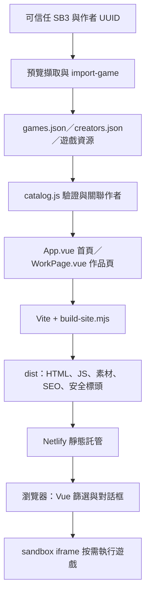

# Scratch 學習館

使用 Vue 3 + Vite 製作的簡約教育遊戲展示網站，可在站內播放 TurboWarp Packager 匯出的 Scratch 遊戲。

## Netlify 上架與搜尋收錄

專案已提供 `netlify.toml`，Netlify 應以此專案根目錄建置、發佈 `dist/`。每次建置會產生首頁與 `/works/<作品 UUID>/` 靜態介紹頁，內含可直接讀取的作品內容、獨立標題、說明及分享標籤；點封面仍直接遊玩，點作品名稱可開啟介紹頁。

正式網址由 Netlify 的 `URL` 自動取得。若使用自訂網域，將建置環境變數 `SITE_URL` 設成 `https://你的網域`，並在 Netlify 設定主要網域及別名轉址。只支援根網域部署，不支援子目錄。

- 正式建置會輸出 canonical、`sitemap.xml` 與 `robots.txt`；預覽與分支部署加上 noindex，避免測試內容收錄。
- 本機未設定正式網址時，也會產生 noindex 版本；不要把這份本機測試 `dist/` 直接當作正式站上傳。
- 若手動上傳，先在 PowerShell 設定 `$env:SITE_URL = 'https://你的正式網址'`，再執行 `npm run verify` 與 `npm audit --audit-level=high`，只上傳產出的 `dist/`。
- 上線後執行 `npm run check:live -- https://你的正式網址`，並在 Google Search Console 驗證網域、提交 `/sitemap.xml`、檢查首頁及一個作品網址。搜尋收錄與排名由搜尋引擎決定。
- 新增作品時提供真實且具體的 `description`，可另外填入 `controls`、`objective`；不要只改標題複製介紹。作者署名沿用現有資料，由站主確認公開授權。
- 安全機制、每月兩次的完整套件檢查、故障處理及上線限制詳見 [SECURITY.md](SECURITY.md)。
- 不使用 GitHub Actions 時，在本機執行 `npm run verify:local`：包含建置、安全測試、Chrome 遊戲測試及連線 npm 的弱點掃描，不需綁卡。這是手動檢查，產出的 `dist/` 為 noindex 測試版；正式部署仍由 Netlify 重新建置。

參考：[Google JavaScript SEO](https://developers.google.com/search/docs/crawling-indexing/javascript/javascript-seo-basics)、[Netlify 自訂標頭](https://docs.netlify.com/manage/routing/headers/)、[MDN iframe sandbox](https://developer.mozilla.org/en-US/docs/Web/HTML/Reference/Elements/iframe)。

## 本機啟動

```powershell
cd C:\Users\nini9\Work\scratch-gallery
npm install
npm run dev
```

開啟 <http://127.0.0.1:3000>。

## 自動產線：SB3 → 精彩預覽圖 → TurboWarp ZIP → 網站

先讓遊戲自動執行，擷取數個不同時間點的預覽候選圖：

```powershell
npm run capture-previews -- "C:\Games\math.sb3" --slug math-adventure
```

候選圖會以壓縮 WebP（480×360）放在 `.packages/previews/math-adventure/`，這一步不會修改網站。請逐張檢視並選擇最能代表遊戲的一張：主角與玩法清楚、動作或特效精彩，而且不是載入、轉場、空白或文字被遮住的畫面。若預設時間點沒有理想畫面，可以指定毫秒時間重新擷取：

```powershell
npm run capture-previews -- "C:\Games\math.sb3" `
  --slug math-adventure `
  --times "800,1600,3000,5000,8000,12000"
```

確認候選圖後，在匯入時透過 `--thumbnail` 使用選中的畫面：

第一次加入學生時，先建立永久作者 UUID：

```powershell
npm run register:creator -- --name "學生名字" --class "Scratch-115"
```

同名學生不會自動合併；每次註冊都會得到不同 UUID，避免不同班級或同班同名學生混淆。取得作者 UUID 後，再提供 SB3 路徑與作品資料：

```powershell
npm run import-game -- "C:\Games\math.sb3" `
  --title "數學探險島" `
  --creator-id "123e4567-e89b-42d3-a456-426614174000" `
  --description "練習基礎運算與問題解決。" `
  --category "數學" `
  --age "8–12 歲" `
  --tags "運算,闖關" `
  --thumbnail ".packages\previews\math-adventure\04-7000ms.webp"
```

產線會自動配發永久作品 UUID、驗證作者 UUID、打包與共用資源，並更新 `public/games.json`。作者姓名、身分與班級集中保存在 `public/creators.json`，作品只透過 `creatorId` 連結作者。

更新既有作品時，從 `public/games.json` 找到原作品 UUID，明確指定 `--id` 與 `--replace`：

```powershell
npm run import-game -- "C:\Games\math-v2.sb3" `
  --id "123e4567-e89b-42d3-a456-426614174000" `
  --replace `
  --title "數學探險島"
```

同一位學生的新作品沿用作者 UUID，但不要沿用舊作品 UUID；省略 `--id` 即會自動建立新作品。

查看全部參數：

```powershell
npm run import-game -- --help
```

匯入封面時建議優先使用 WebP 或 AVIF。若封面超過 1.5 MB，匯入工具會顯示優化提醒。

## 圖片、影片與檔案效能規範

- 圖片：優先使用 AVIF/WebP，單張建議不超過 1.5 MB，並依實際顯示尺寸輸出。
- 影片：優先使用 MP4（H.264）或 WebM，單支建議不超過 12 MB；較長影片應降低解析度或位元率。
- 音訊：優先使用 MP3、M4A 或 OGG，單檔建議不超過 2 MB；WAV 僅適合很短的音效。
- 其他單檔：建議不超過 15 MB，避免在首屏直接載入。
- 驗證完成後刪除多餘截圖、影片、重複素材及暫存資料夾；正式專案只保留實際使用且已壓縮的檔案。

網站會自動延遲載入非首屏圖片、按需載入放大影片、離開畫面時暫停影片，並在關閉播放器時釋放媒體資源。正式打包會替程式引用的媒體產生版本雜湊檔名，便於瀏覽器長期快取。

每次新增資源後執行：

```powershell
npm run audit:assets
```

### 遊戲資源共用與清理

匯入工具會自動把重複的 TurboWarp 執行核心與 Scratch 素材移到
`public/games/_shared/`。各遊戲只保留自己的 `index.html`、`project.json`、
封面與必要資料，因此相同背景、音效或執行核心不會隨作品數量重複保存。

若手動加入、刪除或替換遊戲，執行：

```powershell
npm run optimize:games
npm run audit:assets
```

第一個指令會依內容雜湊合併相同資源，並移除不再被任何遊戲引用的共用檔案；
第二個指令會檢查單檔大小與重複內容預算。不要直接刪除
`public/games/_shared/`，其中的檔案可能同時被多個作品使用。

此指令會列出最大的十個資源，並在檔案超過上述建議上限時讓檢查失敗。

## 手動加入打包後的 Scratch ZIP

建議從 TurboWarp Packager 選擇 ZIP 輸出。ZIP 內必須有可獨立執行的 `index.html`。

1. 為作品建立 UUID 資料夾，例如 `public/games/123e4567-e89b-42d3-a456-426614174000/`。
2. 將 ZIP 完整解壓到該資料夾。
3. 確認路徑為 `public/games/123e4567-e89b-42d3-a456-426614174000/index.html`。
4. 在 `public/games.json` 新增或修改作品：

```json
{
  "id": "123e4567-e89b-42d3-a456-426614174000",
  "creatorId": "另一個作者 UUID",
  "title": "數學探險島",
  "description": "練習基礎運算與問題解決。",
  "category": "數學",
  "age": "8–12 歲",
  "tags": ["運算", "闖關"],
  "playUrl": "/games/123e4567-e89b-42d3-a456-426614174000/index.html",
  "thumbnail": "/games/123e4567-e89b-42d3-a456-426614174000/cover.webp"
}
```

`thumbnail` 可以留空。ZIP 不能直接由瀏覽器執行，必須先解壓縮。

## 指令

```powershell
npm run dev      # 開發伺服器
npm run build    # 產生正式部署檔 dist/
npm run preview  # 預覽正式部署檔
npm run check    # Vue 型別檢查
npm run audit:assets # 檢查媒體與靜態檔案大小
npm run audit:catalog # 檢查作者與作品 UUID 關聯
npm run optimize:games # 共用重複遊戲資源並清除未引用檔案
npm run register:creator -- --name "姓名" --class "班級" # 建立作者 UUID
```

## 架構與資料流

本站採用 **靜態頁面生成 + Vue 互動 + 隔離遊戲播放器**，部署到 Netlify；沒有常駐應用伺服器、API、資料庫或登入系統。作品資料隨程式建置，更新內容需要重新部署。



### 模組責任

- **資料層**：`public/creators.json` 保存作者 UUID、姓名、身分與班級；`public/games.json` 保存作品 UUID、作者關聯與素材路徑。`src/lib/catalog.js` 驗證資料，`src/composables/useGames.js` 在建置與瀏覽器共用同一份目錄，不在執行時請求 API。
- **呈現層**：`src/main.js` 依網址選擇 `App.vue` 或 `WorkPage.vue`，未使用 Vue Router。`src/components/` 管理卡片、影片與播放器，`styles.css` 統一樣式。作品頁連結採一般網頁導覽。
- **靜態生成**：`scripts/build-site.mjs` 用 Vue 伺服器渲染 API 在建置時產生 HTML，無 JavaScript 也能讀取介紹；瀏覽器使用 `createApp().mount()` 重新掛載互動介面，目前不是 hydration。作品數增加時，靜態頁數與建置工作量也會增加。
- **遊戲產線**：`capture-previews.cjs` 擷取候選封面，`import-game.cjs` 匯入作品，`optimize-game-package.cjs` 以內容雜湊共用資源。`public/games/<UUID>/` 保存各作品，`_shared/` 保存共用執行核心及素材。
- **SEO 與防護**：`scripts/site-policy.mjs` 集中網址、收錄與 CSP 政策；建置產出 metadata、robots、sitemap、`_headers` 與真正的 404。介紹頁與遊戲使用不同安全政策，播放器透過 sandbox 隔離；細節見 [SECURITY.md](SECURITY.md)。
- **驗證與部署**：`npm run verify` 檢查資料、資源、型別、安全及產出。GitHub Actions 另跑 npm 弱點掃描與 Chromium 遊戲測試；Netlify 依 `netlify.toml` 執行 verify 與弱點掃描後發佈 `dist/`。Actions 與 Netlify 各自執行，Netlify 建置沒有等待 GitHub 瀏覽器測試的步驟。

### 維護判斷

此架構適合目前以展示及遊玩為主的網站：維護範圍集中在靜態內容、套件、遊戲隔離與平台帳號。JSON 目錄和已發佈素材皆公開；若新增帳號、私人作品或訪客上傳，需要另設後端與權限機制。

目前首頁及作品頁共用入口，入口也靜態引用兩種頁面元件與完整目錄；目錄增長後可再評估分頁或拆分載入。現階段先保持單一資料驗證與集中安全政策，避免為少量作品增加維護成本。初始化規則放在 [AGENTS.md](AGENTS.md)，操作教學留在本文件，安全維護細節留在 [SECURITY.md](SECURITY.md)。

只放入你信任的打包檔，因為打包後的 HTML 與 JavaScript 會在網站內執行。

Scratch 是 Scratch Foundation 的專案。本網站並非 Scratch 官方網站。
