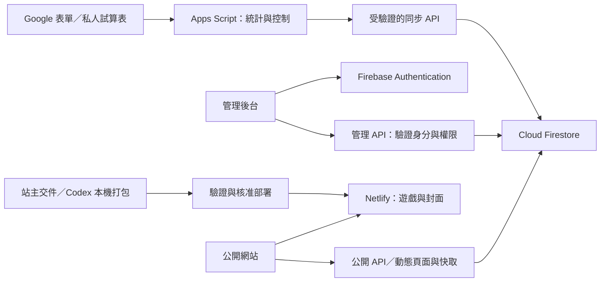

# Scratch 學習館：Firebase 後台三階段實作設計

- 建立日期：2026-10-08（台灣時間）。
- 文件狀態：原始三階段設計。站主後續已授權第一、二階段並完成本機實作與驗證；活動／雲端連線狀態以 [設定與操作紀錄](FIREBASE-ADMIN-SETUP.md) 為準，作品狀態見 [第二階段操作指南](FIREBASE-WORKS-SETUP.md)。正式部署尚未核准；第三階段尚未實作。
- 本機基準：Vue 3／Vite、Node.js 24、網站版本 1.2.1。

> 本文件供後續實作逐階段使用。下列需求紀錄與核取方塊保留原始規劃，並非目前完成狀態；第一、二階段實作與尚待正式切換項目見上述設定文件。實作前重新確認套件、平台限制、帳務與雲端設定。

## 0. 已確認的需求與範圍

### 0.1 站主已確認

1. 已建立 Scratch 學習館專用的 Firebase 專案，與另一款作品的 Firebase 專案分開。
2. 除建立專案外，尚未完成登入驗證、Firestore 設定、網站註冊、權限配置或 Netlify 連接。後續需要 Codex 協助逐項設定及驗證。
3. 已完成的活動介面，未來透過後台管理公開狀態、內容與時程，日常設定更新不重新部署 Netlify。
4. Scratch 來源由站主整理後交給 Codex；由 Codex 在本機打包、選封面、檢查與整理。
5. 不建立遊戲檔案上傳後台、不使用 Firebase Cloud Storage。遊戲、封面與共用素材繼續隨 Netlify 部署發布。
6. 新增或更新遊戲檔案仍需要正式部署；已部署作品的介紹、排序、公開狀態與上架操作，完成架構改造後由後台管理。
7. 投票第一版採 Google 表單：限制每個 Google 帳號一次回覆，不收集 Email、不詢問姓名；網站顯示票數，後台管理統計。
8. 本次工作只建立設計文件，不授權修改雲端設定、建立正式資料、推送 main、正式部署或變更付費方案。

### 0.2 三大實作步驟

| 階段 | 主題 | 完成後可做的事情 | 依賴 |
| --- | --- | --- | --- |
| 第一步 | Firebase 連接、管理者登入與活動管理 | 登入後台，開關既有活動、修改文字與時程，前台不經部署更新 | 協助站主完成 Firebase 設定及測試 |
| 第二步 | 作品資料與上架管理 | 管理已部署作品的介紹、排序、上架／下架、NEW 與更新提示 | 第一步權限與 API；發布規範及頁面產生方式調整 |
| 第三步 | Google 表單投票統計管理 | 綁定活動投票、同步票數、控制結果公開、結束投票與確認結果 | 第一、二步活動／作品 UUID；Google 表單與 Apps Script 授權 |

### 0.3 部署邊界

| 操作 | 完成改造後需部署 Netlify？ |
| --- | --- |
| 開關已完成的活動介面、修改文字／時程 | 否 |
| 修改已部署作品的介紹、分類、排序、顯示狀態 | 否 |
| 公開已部署且已驗證的作品 | 否；仍需站主在後台明確確認 |
| 同步票數、公開結果 | 否 |
| 新增或更新 Scratch 遊戲、封面、共用素材檔案 | 是 |
| 新增活動介面種類、修改播放器、後台或其他程式功能 | 是 |
| 初次建立這套後台及動態資料架構 | 是 |

預先部署但未列在目錄中的遊戲仍可能被直接開啟；`public/`、隱藏卡片與 noindex 均不提供私人草稿保護。若作品不適合提前公開，延後遊戲檔案部署。

## 1. 共用架構與設計原則

### 1.1 服務分工

| 層次 | 方案 | 責任 |
| --- | --- | --- |
| 公開網站 | 現有 Vue＋Netlify | 首頁、活動、師生作品庫、介紹頁與播放器 |
| 管理後台 | Vue，獨立的 `/admin/` 入口 | 管理操作、預覽、錯誤提示；不加入 Router 或全域狀態套件 |
| 身分驗證 | Firebase Authentication | 第一版建議使用站主 Google 帳號登入 |
| 管理資料 | Cloud Firestore | 活動、作品內容、作者、上架狀態、設定、統計摘要與操作紀錄 |
| 後端 | Netlify Functions | 公開資料投影、ID Token 驗證、管理權限、資料驗證、交易與 Google 串接 |
| 遊戲與媒體 | Netlify 靜態檔案 | 沿用 `/games/`、`_shared/`、封面及雜湊資源 |
| 遊玩計數／排行榜 | 既有 Functions／Blobs | 第一版保留，僅調整作品資格驗證入口 |
| 投票來源 | Google 表單、私人回應試算表 | 收集不記名回應與查核原始資料 |
| Google 同步 | Apps Script | 讀取表單回應、產生統計、控制接受回覆狀態 |



### 1.2 單一資料來源

- **活動設定**：完成第一步切換後，以 Firestore 為準；`contentUpdates.js` 保留純計算函式，不再維護第二份可獨立編輯的正式活動設定。
- **作品／作者公開內容與狀態**：完成第二步遷移後，以 Firestore 為準；JSON 若保留，限定為遷移來源、本機匯入資料或可重建快照。
- **已部署遊戲資源**：以該次 Netlify 部署所附的資源清單為準，Firestore 不能任意指定不存在的檔案或外部網址。
- **投票原始回應**：以 Google 表單回應為正式來源；連結試算表作查核工具，不以手改儲存格代替修改選票。
- **票數摘要**：Firestore 保存可重新計算的摘要；不要直接手改票數。
- 遷移採一次性匯入及明確切換，不建立無限期的 JSON／Firestore 雙向同步。

### 1.3 公開讀取與管理寫入

建議訪客透過同源公開 API 讀取資料，後台透過管理 API 寫入；第一版不開放瀏覽器直接讀寫 Firestore。

- Firestore 用戶端 Rules 預設拒絕直接讀寫；伺服器憑證另用 IAM 限制權限。
- **Firebase Admin SDK 會繞過 Firestore Security Rules**，因此每支管理 API 都必須自行驗證 Token、管理者資格及欄位；不能依賴 Rules 替伺服器擋錯誤寫入。[官方權限說明](https://firebase.google.com/docs/firestore/security/get-started)
- 管理者角色與作品作者的 `student`／`teacher` 身分分開，老師作者不自動具有後台權限。
- 僅回傳公開需要的欄位，不公開管理者 UID、帳號、私人表單識別、操作紀錄或草稿。
- 管理 GET、POST、錯誤與登入相關回應一律 `no-store`；不得與訪客快取混用。
- 管理寫入使用 Firebase ID Token 的 Authorization 標頭，伺服器驗證所屬專案、Token 有效性及撤銷狀態，再查啟用中的管理者資格。[ID Token 驗證文件](https://firebase.google.com/docs/auth/admin/verify-id-tokens)
- 資料更新使用版本號與交易，阻擋兩個後台分頁互相覆寫；以 `operationId` 處理重試，避免上架或同步重複執行。
- 不接受任意 HTML、script、iframe 程式碼；內容用結構化欄位及受控連結呈現。

### 1.4 時間、快取與失敗行為

- Firestore 時間欄位使用 Timestamp；API 輸出 ISO 8601；介面統一顯示台灣時間 `Asia/Taipei`。
- 正式上架、稽核及版本時間由後端產生；不用訪客電腦時間決定投票資格或正式發布時間。
- 第一版建議公開設定短快取 15～30 秒，票數快取 30～60 秒；實作時依用量測試決定，不承諾全球秒級同步。
- 公開內容變更後清除相關快取標籤，前台重新取得資料；處理清除失敗，後台顯示「已儲存，等待公開更新」而非假定已生效。[Netlify 快取文件](https://docs.netlify.com/build/caching/caching-overview/)
- 動態回應不得把過期的「投票開放」狀態視為接受投票的授權。
- Firestore 或 Google 連線失敗時，後台禁止新增寫入並提供重試；票數保留最後成功版本並標示時間，不顯示成 0。
- 無資料且讀取失敗時回傳暫時無法取得資料的狀態；不能把服務故障當成作品不存在或空作品庫。
- 已載入頁面切回可見時刷新；背景頁面暫停輪詢，既有遊戲影片與 iframe 釋放規則維持。

## 2. 第一步：Firebase 連接、管理者登入與活動管理

### 2.1 階段目標

完成 Firebase 的首次設定與驗證，建立只供站主管理的後台，以及一個能控制既有活動介面的完整流程。此階段不搬作品資料、不建立遊戲上傳、不接正式投票。

### 2.2 Firebase 設定清單：目前全部待確認

- [ ] 由站主提供／確認新專案名稱與 `projectId`，核對確實是本站專用專案。
- [ ] 確認目前方案、Firestore 是否建立、資料庫位置、實際讀寫與儲存用量；尚未啟用服務時不要把另一專案用量視為本站可用額度。
- [ ] 註冊本站 Web App，取得 Firebase Web 設定。Web 設定不等於伺服器私鑰，權限仍須另外配置。
- [ ] 啟用 Firebase Authentication 的 Google 登入，設定支援 Email 與必要 OAuth 設定。
- [ ] 設定授權網域：正式網域、本機測試網域，以及確實需要的測試網域；不得假設所有 Deploy Preview 網域自動可登入。
- [ ] 建立 Firestore，選定位置及鎖定權限；不要用允許所有人讀寫的 test mode 作為正式設定。
- [ ] 設定伺服器服務身分；優先評估適用的工作負載身分，若需服務帳號私鑰，以秘密環境變數保存並規劃輪替。[Admin SDK 設定文件](https://firebase.google.com/docs/admin/setup)
- [ ] 配置 Netlify 伺服器端憑證及預期 Firebase 專案 ID；密鑰不得帶 `VITE_` 前綴，也不得寫入 Git、`public/`、Markdown 或前端產出。
- [ ] 確認首位管理者的 Firebase UID，用受信任的初始化流程加入允許清單；不得讓訪客自行建立或提升管理權限。
- [ ] 建立 Emulator 測試環境；必要的雲端預覽使用另一個測試 Firebase 專案。正式憑證不提供給一般預覽。
- [ ] 驗證登入、登出、Token 過期／撤銷、非管理者拒絕、Firestore 讀寫與資料隔離。

**協作方式**：Codex 準備程式與設定說明；需要站主互動登入、確認 Google 授權或輸入秘密時，透過控制台／秘密輸入完成。不要要求站主在聊天貼出服務帳號私鑰。新增付費服務、正式設定及正式發布仍按當次授權執行。

Google 登入第一版建議從使用者點擊觸發的 popup 開始驗證，並測試手機與封鎖 popup 的情況；若採 redirect，需依 Netlify 外部託管情境處理第三方儲存限制。[Google 登入](https://firebase.google.com/docs/auth/web/google-signin)、[redirect 最佳實務](https://firebase.google.com/docs/auth/web/redirect-best-practices)

### 2.3 管理後台介面

`/admin/` 由 `src/main.js` 的既有網址分流方式載入獨立模組；公開首頁不載入 Firebase 登入 SDK 或後台程式。

第一版畫面包含：登入／無權限、概況、活動列表、活動編輯、預覽與操作結果。未登入時不請求私人資料；登出後清除後台記憶體資料。後台 HTML 與私人 API 使用 noindex，存取控制仍靠登入與後端權限，不靠 noindex。

活動編輯欄位建議包括標題、簡介、既有介面模板、公開狀態、提醒／開始／結束時間、投稿連結、示範作品、排序。操作鈕使用「儲存草稿」「預覽」「公開活動」「發布內容更新」「隱藏活動」，讓正式操作清楚可辨。

### 2.4 Firestore 初始資料設計

以下集合與欄位為建議契約，尚未建立。以 `schemaVersion: 1` 標示資料格式；API 對缺值使用明確預設，不默默接受任意欄位。

| 路徑 | 主要欄位 | 存取與用途 |
| --- | --- | --- |
| `admins/{uid}` | `enabled`、`role`、`createdAt`、`updatedAt` | 伺服器驗證管理資格；第一版 role 只設 owner |
| `siteSettings/public` | `featuredActivityId`、`newWorkWindowDays: 15`、`contentVersions`、`revision`、`updatedAt` | 控制推薦活動及導覽更新提示；公開 API 只投影必要欄位 |
| `activities/{activityId}` | `templateKey`、`status`、`title`、`description`、`remindFrom`、`startsAt`、`endsAt`、`submissionUrl`、`previewId`、`sortOrder`、`revision`、`updatedAt` | 活動內容；status 為 draft／published／archived |
| `activityDrafts/{activityId}` | 活動待發布內容、`baseRevision`、`updatedAt`、`updatedBy` | 私人編輯草稿；不覆寫正在公開的活動內容 |
| `auditLogs/{operationId}` | `actorUid`、`action`、`targetType`、`targetId`、`beforeRevision`、`afterRevision`、`changedFields`、`createdAt` | 私人操作紀錄；不保存 Token 或秘密 |

`status` 表示管理狀態；upcoming／open／closing／closed 依時間推導，不同時維護互相衝突的多份布林值。公開狀態、投票狀態與結果公開狀態分開，第三步才擴充投票資料。

`templateKey` 只能使用部署程式提供的模板清單。連結需驗證 HTTPS、允許網域及用途；既有活動示範只能選已部署的 standalone ID。日期驗證需包含 `startsAt < endsAt`。

### 2.5 API 與前台切換

| 建議端點 | 責任 |
| --- | --- |
| `GET /api/site-config` | 公開設定、推薦活動、伺服器時間、資料版本 |
| `GET /api/activities` | 公開活動列表，排除草稿 |
| `GET /api/admin/activities` | 管理列表，包含草稿，需管理權限 |
| `POST /api/admin/activity-save` | 白名單欄位更新；檢查 expectedRevision／operationId |
| `POST /api/admin/activity-publish` | 明確公開／隱藏操作、交易及稽核 |

後台先保存至 activityDrafts，站主預覽後再明確公開；發布交易檢查 baseRevision，再將驗證過的草稿寫入 activities 正式版本與稽核。已公開活動編輯也使用此流程，按「發布內容更新」才變更正式內容；不得讓任意文字儲存順便公開活動。

目前首頁活動內容有預先渲染結果。切換時需一併處理首屏 HTML，不能只在瀏覽器載入後藏掉舊活動，卻讓搜尋引擎與無 JavaScript 訪客仍看到它。第一步須提供一致的公開 HTML：建議將受活動設定影響的首頁交由 Functions 產生並短快取，沿用 Vue 元件與網站政策；活動資料失敗時顯示暫時無法載入，不回退公開已隱藏的舊活動。

### 2.6 驗收與發布

- [ ] 未登入、一般 Google 帳號、其他 Firebase 專案 Token 均不能修改活動。
- [ ] owner 能登入並修改一個測試活動；保存後資料正確，過期版本更新回傳衝突。
- [ ] 不部署即可切換公開狀態，首頁 HTML 與瀏覽器畫面皆一致；生效時間達到實作時訂定的目標。
- [ ] 時間驗證、關閉後投稿連結、階段提醒、導覽已讀提示與雙語介面正常。
- [ ] Firebase 失敗時有明確狀態，沒有秘密進入網路回應、日誌或 build 產物。
- [ ] CSP 僅在後台加入必要 Firebase／OAuth 來源，公開網站與遊戲政策分開；驗證登入與 iframe 沙盒皆正常。
- [ ] 執行 `npm run verify`；登入、安全政策或套件變更另執行 `npm run verify:local`。
- [ ] 取得本階段正式發布核准，正式設定重跑 verify，確認 GitHub／Netlify 成功；網域或標頭變更後執行 check:live。

完成第一步後，更新 README／SECURITY 的現況說明；作品依舊走現有流程。建議下一步指令：「依本文件第一步完成本機與測試環境的 Firebase 連接、站主登入及活動管理；正式設定／發布另按核准流程處理。」

## 3. 第二步：作品資料、上架狀態與 NEW 管理

### 3.1 階段目標與限制

遊戲仍由 Codex 本機匯入，隨 Netlify 發布。後台管理已存在、已驗證的作品，不上傳或打包遊戲。目錄、介紹、排序、公開狀態與 NEW 不再依賴重新部署。

必須先解決目前 JSON 與 build 流程的發布耦合，才能合理地預先部署檔案、稍後由後台公開。

### 3.2 發布規範調整：本階段的前置工作

現行規則是 `releasePending: true` 的作品不可進正式建置，核准後先執行 `release:mark` 寫入 `publishedAt`，再部署。這與「預先部署檔案，後台稍後上架」不完全相容。

**本文件不是繞過現行規則的授權。** 第二步需要站主審閱並確認新的發布制度，再同步修改 AGENTS.md、README、SECURITY、匯入／release 工具與建置檢查；在此之前保持現行流程，不移除 pending 檢查來強行部署。

新制度建議分成兩個核准點：

| 操作 | 核准及時間紀錄 |
| --- | --- |
| 遊戲檔案部署 | 站主當次明確批准 main 推送／合併或正式部署；記錄 `assetsDeployedAt`、部署 ID／commit 與資源版本 |
| 作品目錄上架 | 站主於後台明確按「確認上架」，或當次授權 Codex；後端記錄第一次正式目錄公開的 `publishedAt` |

核准預載檔案時明確告知其公開可存取性。NEW 的 15 天從目錄第一次上架的 `publishedAt` 起算，重新上架與更新遊戲不重算。`release:mark` 保留作為工具入口，但在新制度落實後改為呼叫相同的後端上架流程，不再維護另一份獨立時間。

### 3.3 資源清單與內容分離

建議增加版本控制內的「部署資源清單」，檔名例如 `public/game-assets.json`；具體名稱實作前確認。它只描述實際隨部署存在的可公開檔案，不承擔作品文案與公開狀態。

每筆至少包含 `gameId`、`assetVersion`、`playUrl`、可用封面清單、共用資源參照及必要校驗值；建置驗證遊戲入口、素材完整性、大小、ID 唯一及安全政策。

- 後端只能讓作品選用當前正式部署資源清單內的版本與白名單路徑。
- 保留 `/games/<UUID>/index.html`、既有作者 UUID 與作品 UUID，不接受任意外部播放網址。
- 保留 `_shared/` 內容雜湊共用與未引用清理；不能為下架某作品刪整個共用目錄。
- 資源版本與 Firestore 狀態需要互相核對，不能只靠人工填 `assetsReady: true`。
- 正式部署成功後，以受驗證且可重跑的流程匯入新增作品草稿。不可由未確認成功的 build 直接把作品標成可上架。
- 新部署匯入不得覆寫後台已編輯的介紹、排序、`publishedAt`；採 dry-run 差異報告與明確的新增／資源更新模式。
- 預覽部署不得寫入正式 Firestore 或正式計數。

### 3.4 Firestore 作品資料

| 路徑 | 主要欄位 | 規則 |
| --- | --- | --- |
| `creators/{creatorId}` | `name`、`role`、`className`、`revision`、`updatedAt` | 沿用永久 UUID；role 衍生 creatorType；公開署名經站主確認 |
| `works/{gameId}` | `creatorId`、`title`、`description`、`category`、`age`、`tags`、`devices`、`controls`、`objective`、`thumbnail`、`thumbnailLayers`、`assetVersion`、`status`、`sortOrder`、`publishedAt`、`revision`、`updatedAt` | 對應現有資料型別；status 為 draft／published／unlisted |
| `workDrafts/{gameId}` | 作品待發布內容、`baseRevision`、`updatedAt`、`updatedBy` | 私人編輯草稿；預覽後明確發布內容更新，首次上架時間不變 |
| `workRevisions/{revisionId}` | `gameId`、`previousContent`、`createdAt`、`actorUid` | 私人內容回復版本；設保留政策，不記秘密 |

`publishedAt` 草稿為 null，首次上架由伺服器寫入，後台不提供任意改寫；不以移轉資料時間重置既有作品日期。封面只能選已部署的允許素材；新增封面仍須交由本機流程部署。

第一版採立即上架，不加入作品排程上架，避免尚未完成排程鎖定、核准與版本檢查就自動發布。若日後新增，另行設計。

### 3.5 前後台、介紹頁與 SEO

| 範圍 | 調整 |
| --- | --- |
| `useGames.js` | 由內建 JSON 改為公開目錄 API；保留資料驗證與作者關聯，避免首頁載入整份目錄 |
| 師生作品庫 | 保留每批 9 件；採穩定排序及 cursor 分頁，不一次讀完所有 Firestore 文件 |
| `/works/<UUID>/` | 改為後端讀取公開作品並產生 HTML，瀏覽器用同一份資料重新掛載 |
| 網站介紹／分享 | 回傳正確 canonical、OG／Twitter、封面與署名；內容變更清除對應快取 |
| sitemap | 由公開作品動態產生並快取；不得保留已下架作品的舊清單 |
| 真正 404 | 不存在／未公開作品回傳 404；資料服務故障回傳 503，保留無 SPA catch-all 規則 |
| 遊玩計數／排行榜 | 用共用作品資格檢查辨識已部署且允許的作品，不再只依打包進 Function 的舊 games.json |
| NEW | `publishedAt + newWorkWindowDays` 推導；保留 15 天預設，不用逐件手動開關 |
| 導覽更新提示 | 首次公開或站主明確發布更新時增加內容版本；訪客已讀保留本機記錄，避免每次自動儲存都提示 |

動態 `/works/*`、作品庫與 sitemap 採精確路徑規則，動態頁面用 site-policy 共用安全與 SEO 產生邏輯。部署內既有靜態作品頁必須停止輸出或由精確規則接管，避免靜態檔案優先回傳舊文案。不要只改前端標題而保留舊分享標籤。

後台提供作品列表、條件篩選、編輯／預覽、上架／下架、排序、歷史內容回復與資源部署狀態。保留鍵盤、焦點、至少 44×44 px 控制項與 reduced-motion。

### 3.6 新作品操作流程

1. 站主交付可信任且可公開的 SB3 與作品資料，沿用作者 UUID 或先 register:creator。
2. Codex 擷取候選封面、站主選定代表畫面、匯入打包，檢查共用資源；新作品使用新 UUID，更新使用原 UUID／replace。
3. 執行資源與完整驗證；先完成預覽，不寫正式資料。
4. 站主核准本次遊戲檔案正式發布後，以正式設定驗證並部署；核對 GitHub／Netlify 成功及實際入口可玩。
5. 使用受驗證流程將新作品與實際部署資源版本登記為 Firestore 草稿，不自動上架。
6. 站主後台預覽並確認署名、封面、介紹與檔案狀態，明確按「確認上架」。
7. 後端交易寫入公開狀態、首次 `publishedAt`、版本與稽核，清除相關頁面／目錄／sitemap 快取，前台取得新資料。
8. 記錄公開檢查結果；完成工作確認後清理本次暫存，保留 SB3、生成腳本、選定成果與必要備份。

### 3.7 遷移、回復與驗收

- [ ] 先備份現有 JSON 與發布時間；dry-run 顯示作者／作品數、重複 ID、關聯與差異。
- [ ] 匯入保留全部 UUID、`publishedAt`、作者 role、控制說明及排行榜設定；活動示範不混入師生作品庫。
- [ ] 第一件試點作品驗證成功後再批次遷移；公開 API 結果與舊目錄逐筆核對。
- [ ] 新部署草稿不提前進公開目錄；資源缺失、部署版本不符時拒絕上架。
- [ ] 不部署即可修改介紹、排序與公開狀態；初始 HTML、分享標籤、sitemap 同步。
- [ ] NEW 邊界、未到時間、15 天到期、更新作品與重新上架不重置日期均正確。
- [ ] 原有遊戲、暫停／停止／全螢幕、關閉釋放、計數、排行榜及 opaque-origin 沙盒均通過。
- [ ] 回復文案不改 UUID 或首次上架時間。遊戲檔案回復仍經部署；部署回復前核對 Firestore 所選版本是否存在，避免回復程式後留下失效作品。
- [ ] 接管完成後停用舊公開資料入口；不能以過期 JSON 回退重新公開已下架作品。
- [ ] 跑 verify、verify:local；核准後正式驗證與部署，路由／標頭變更後跑 check:live。

建議下一步指令：「依本文件第二步設計並實作作品資料與上架管理，先提出發布規範調整，保留本機打包與 Netlify 靜態檔案，不加入遊戲上傳或 Cloud Storage。」

## 4. 第三步：Google 表單投票統計管理

### 4.1 投票與不記名的界線

投票表單與目前投稿／檔案上傳表單分開，投票表單不包含姓名、Email 或檔案上傳。開啟「限制一次回覆」並選擇「不收集電子郵件地址」；第一版關閉編輯回覆。

Google 要求作答者登入，但未開啟收集 Email 時，表單回應不記錄登入帳號名稱。此方案保證的是「每個 Google 帳號一次」，不是「每個真人一次」；同一人可有多個帳號。不記名針對主辦方收到的資料，不宣稱對 Google 完全匿名。[Google 官方設定說明](https://support.google.com/docs/answer/2839588?hl=zh-Hant)

活動規則需在開放前確認：投票資格、每張選票可選幾件、截止時間、同票處理、票數是否決定獎項、公開票數方式。預設建議一張選票選一件；若採多選，後台分別顯示「有效選票數」與「總選擇數」，避免數字誤導。

### 4.2 需要站主與 Codex 共同完成的設定

- [ ] 建立投票專用 Google 表單與私人回應試算表，核對實際登入及不收 Email 設定。
- [ ] 確認表單擁有者／Apps Script 執行帳號與授權，試算表不要公開發布。
- [ ] 為每個選項配置固定作品代碼並對應作品 UUID，與題目 item ID 一起保存。
- [ ] 建立 Apps Script，使用表單提交的 installable trigger 與定時補同步；不將它錯寫成 simple trigger。[Google 觸發器文件](https://developers.google.com/apps-script/guides/triggers/installable)
- [ ] 設定 Apps Script 與 Netlify 的伺服器同步秘密，保存在 Script Properties／秘密環境變數，不放表單、網址或前台。
- [ ] 若需要後台直接開關表單，另建立受驗證的 Apps Script 控制入口，限定單一活動綁定的表單。
- [ ] 先用測試表單與測試資料驗證；不得測試寫入正式活動統計。

### 4.3 投票資料契約

| 路徑 | 主要欄位 | 存取與用途 |
| --- | --- | --- |
| `votingConfigs/{activityId}` | `enabled`、`voteStartsAt`、`voteEndsAt`、`acceptanceDesired`、`acceptanceConfirmed`、`resultsVisibility`、`entryIds`、`mappingVersion`、`revision` | 公開 API 只投影活動投票需要的設定與連結 |
| `voteSources/{activityId}` | `formId`、`sheetId`、`questionItemId`、`optionMapping`、`controlStatus` | 私人來源設定，不傳給訪客 |
| `voteSummaries/{activityId}` | `countsByWorkId`、`ballotCount`、`selectionCount`、`invalidCount`、`sourceRevision`、`sourceGeneratedAt`、`lastSyncedAt`、`syncStatus`、`mappingVersion` | 公開票數來源，不保存投票者身分 |
| `voteResults/{resultId}` | `activityId`、`countsByWorkId`、`ballotCount`、`sourceRevision`、`mappingVersion`、`confirmedAt`、`confirmedBy`、`resultVersion` | 確認後的結果快照；公開投影不含確認者 UID |
| `voteSyncJobs/{jobId}` | `activityId`、`status`、`sourceRevision`、`startedAt`、`completedAt`、`errorCode` | 同步追蹤與重試，不保存原始選票 |

不要讓活動編輯畫面直接改票數，也不提供無稽核的「清零」。必要的異常排除需以私人回應 ID 紀錄及理由處理，再重新計算；只憑不記名回應內容不能判斷兩個帳號屬於同一人。

選項代碼建議用可讀的短代碼如 `W001｜作品名稱`，後台保存代碼與 UUID 的映射。正式開放後凍結題目與映射，不靠選項順序或標題模糊比對計票；需要調整時明確建立映射版本並驗證歷史回應。

### 4.4 統計同步方案

第一版面向小型活動，Apps Script 從 Google 表單完整回應重新計算票數，再傳送完整摘要；不採每次收到通知就單純加一。

1. 表單提交觸發器啟動統計；Apps Script 以鎖序列化來源快照與 sourceRevision。
2. 驗證指定題目、選項映射、回應 ID、Google 回應時間與活動截止規則，統計每件作品及選票數。
3. 傳送 `{activityId, jobId, sourceRevision, mappingVersion, counts, totals, sourceGeneratedAt}`，附時間及 HMAC 簽章。
4. Netlify 驗證簽章、有效時間、活動／來源白名單、資料型別與非負整數；不信任公開 HTTP 呼叫的票數。
5. Firestore 交易只接受較新的來源版本；同 job 重送回傳已處理，舊快照不能覆寫新快照。
6. 成功後更新 `lastSyncedAt` 並清除票數快取，前台在更新週期內取得結果。
7. 加入定時完整補同步與手動「立即同步」，讓漏掉的觸發器可以補回；失敗保留上次成功摘要並呈現錯誤。

重試簽章時間可重新產生，但 jobId 與來源版本維持一致。Google 控制與同步入口均需驗證，避免重放請求；秘密分用途配置，不與站主 Firebase Token 混用。

Apps Script 有執行時間與每日服務配額，完整掃描需按實際回應量測試；若活動量超出合理範圍，改成可對帳的增量處理。不要保證觸發器秒級完成或永不漏同步。[Apps Script 限制](https://developers.google.com/apps-script/guides/services/quotas)

### 4.5 後台操作與截止流程

後台提供投票來源、參選作品、規則、目前票數、最後成功同步、同步健康、立即同步、結果顯示及匯出。

「網站允許前往投票」與「Google 表單接受回覆」分開記錄。站主開關投票時，介面顯示 Google 控制的處理中／成功／失敗；失敗不得宣稱投票已開啟或結束。Apps Script 可用 `setAcceptingResponses` 控制來源表單。[Google 表單控制](https://developers.google.com/apps-script/reference/forms/form)

截止建議流程：

1. 站主按「結束投票」，或依經確認的活動規則由受驗證流程執行截止控制。
2. 網站停止顯示投票入口，要求 Google 停止接受回覆，確認來源狀態。
3. 完整重新計票；即使 Google 關閉動作延遲，也依事先公告的截止時間排除超時回應，不能依同步抵達時間判斷。
4. 站主查核未映射／異常回應、同票規則及摘要，按「確認最終結果」。
5. 保存帶來源版本的結果快照，之後一般同步不覆寫最終結果；更正需建立新結果版本、理由及稽核。
6. 按結果公開方式顯示或匯出。活動頁保持可讀，不必與投票入口一起關閉。

第一版表單另開頁面，網站每 30～60 秒同步票數並顯示最後統計時間；返回網站立即重新取得。不要宣稱 Google 表單送出後父頁會自動收到成功通知，也不依表單視窗關閉判定已投票。

### 4.6 驗收

- [ ] 同一 Google 帳號無法再次提交；不收集 Email／姓名；說明文字不誇大為真人唯一投票。
- [ ] 測試單選／多選的選票數、選擇數、作品計數及未映射回應；規則一致且可重新計算。
- [ ] 重送同步不加票、亂序摘要不覆蓋新版本；漏通知可由完整同步補回。
- [ ] 錯誤簽章、過期請求、錯誤來源及一般訪客不能修改統計或操作表單。
- [ ] Google 控制失敗時顯示真實狀態；表單直接連結的接受狀態與後台一致。
- [ ] 截止邊界依來源回應時間測試；結果確認後不被後續同步覆寫。
- [ ] 前台只見票數與允許欄位，原始表單資料及試算表不公開。
- [ ] 同步中斷保留舊票數與最後成功時間；恢復後可對帳；匯出與確認版本一致。
- [ ] 跑 verify；涉及安全、套件／播放器變更另跑 verify:local；核准後依正式發布流程部署並實測。

建議下一步指令：「依本文件第三步完成測試活動的 Google 表單綁定與統計同步；不記名採不收 Email、每 Google 帳號一次，先驗證截止、重試與對帳，正式活動另行確認。」

## 5. 共同維護、檢查與後續交接

### 5.1 版本、文件與成本

- 程式或套件變更依 package.json／lockfile 管理版本，畫面保留 `ver X.Y.Z`；本設計文件不變更版本。
- 每階段完成才把相應設計標記已實作，更新 README、SECURITY、AGENTS 及操作文件，不把規劃當成現況。
- 第一步初始權限與 API，第二步發布流程與資料遷移，第三步 Google 授權各自留下可復現的設定說明；不保存密鑰。
- 查看本站新 Firebase 專案的 Firestore 實際讀寫、索引／儲存與方案，不沿用另一專案數字。Firestore 免費讀寫額度每日重設，未用部分不累積。[Firestore 額度](https://firebase.google.com/docs/firestore/quotas)
- 首次連接、活動前／後、集中部署前查看 Netlify 當期 credits、帳期及剩餘額度；控制台無法讀取時明說限制，不用歷史紀錄估算目前餘額。
- 動態目錄／HTML／票數都使用分頁與合理快取。第一版不讓所有訪客即時監聽全部 Firestore 文件。
- 不使用 Cloud Storage，因此不因本方案直接要求啟用 Storage 或升級 Blaze；其他付費服務若有需求，另行說明與確認。

### 5.2 回復與備份

- 程式版本回復、Firestore 資料回復與遊戲檔案回復是三件事；部署回復不會自動回復資料庫。
- 各階段正式切換前保留資料匯出與可回復程式；在測試環境驗證還原，選擇符合當期方案的備份方式，不假設平台免費提供所有備份功能。
- 操作紀錄與必要內容版本私人保存；備份不得放 `public/`，私人原始回應不混入前台目錄。
- 遊戲下架是停止在網站展示／遊玩入口；已部署靜態檔案與已下載副本不會因此消失。若需撤除實際檔案，另走核准部署並處理快取。
- 不用本機 JSON 直接回填來覆蓋 Firestore 的正式內容；任何修復先列差異與影響。

### 5.3 驗證與發布要求

本文件為純文件變更，檢查內容與 `git diff --check`。後續實作：

```powershell
npm ci
npm run verify
npm run verify:local
```

`verify:local` 產出的 dist 是 noindex 測試版，不直接部署。取得站主當次核准後，以正式環境設定執行 verify，再推送／合併；GitHub 與 Netlify 必要檢查都要成功。正式路由／標頭變更後：

```powershell
npm run check:live -- https://giraffegallery.com
```

補充的測試聚焦實際風險：權限、跨環境隔離、發布狀態、快取失效、資料版本衝突、SSR／SEO、遊戲完整性、投票冪等與截止；不要只測按鈕是否能呼叫 API。

### 5.4 目前待站主確認的資訊

這些資訊在相關階段開始時確認，不必為文件編寫立即提供：

| 時機 | 所需資訊 |
| --- | --- |
| 第一步開始 | 新 Firebase projectId、Firestore 建立與區域狀態、方案、站主登入帳號、測試環境方式 |
| 第二步開始 | 新發布規範、已部署草稿的公開可存取性、既有作品遷移範圍、排序預設 |
| 第三步開始 | 投票表單及擁有者、選幾件作品、資格與獎項規則、截止時間、同票處理、結果公開方式 |

三個階段結束時各留下：已完成清單、驗證結果、待確認項目、正式發布狀態、資料回復方式與下一步。站主確認主要工作完成後，只清理本次暫存與可重建檔案，保留原始 SB3、選定封面、生成腳本與必要備份。
